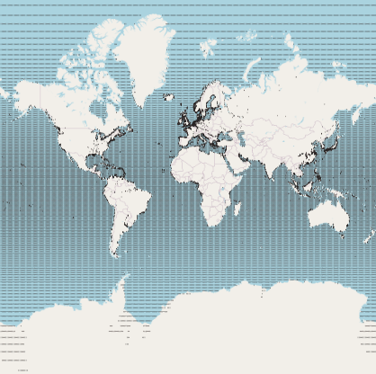
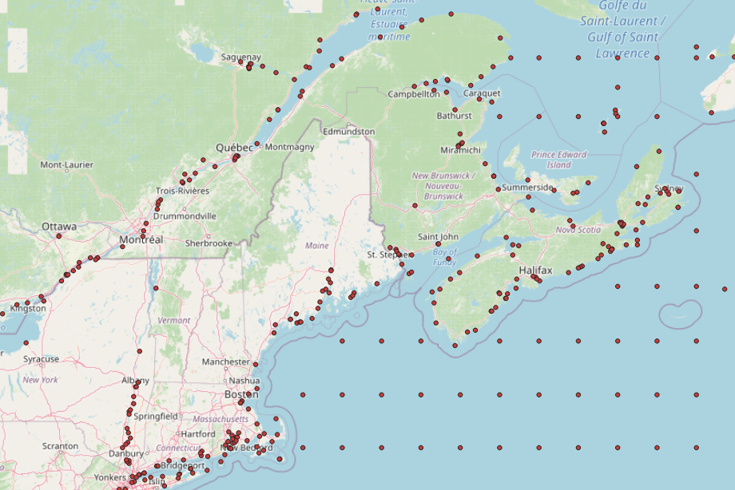

# Port Management Library

This library can be utilized in projects related to risk assessment for ballast water. The library has a dataset **(see "Information about Port Data")** which includes all ports globally and the enviromental variables related to them such as minimum, maximum yearly average and salinity of water in each port. Some ports have a formal name and some are in the middle of body of water. A general view of the port data is shown in the following image.



The ports environmental variables have been revised by subject matter experts at the Bailey lab and updated. Some fresh water salinity has been changed after revisions to make sure the dataset is an accurate representation of environmental variables.

Here is an example of ports near the Canadian border.



Note that this library will be replaced by an API in future to provide the most accurate data.

## Information about Port Data

**File Name :** port_data.csv	  
**File Version:** 1.0.0.  
**File Format:** Comma Separated Values (CSV).  
**Data Custodian:** Sarah Bailey	   
**Security Use Limitation:** none	   
	
**Dataset Title:** Global port environmental data   
**Primary Investigator:** Sarah Bailey; sarah.bailey@dfo-mpo.gc.ca	   
**Data Contributors:** Johanna Bradie, Dawson Ogilvie, Paul Mudroch	   
**Purpose:** Dataset of temperature and salinity values for global ports for use in environmental distance calculations	   
**Data Description:** A list of global ports active in 2019, with four environmental data variables (mean annual salinity, maximum, minimum, and mean annual temperature).   
**Time Period:** 2019   
**Geographic Description:** Global	   
#### Sampling Method:   

Data was initially extracted from Keller et al. (2011) and World Ocean Atlas 2013 Vol. 2 (Locarnini et al. 2013; Zweng et al. 2013). Additional port names were added according to ship traffic information provided by Transport Canada. Salinities of inland freshwater ports modelled by Keller et al. (2011) were corrected where better information was available, and Canadian port data was verified and updated where necessary through literature search or personal communication with local experts.
Keller,†R.†P., Drake,†J.†M., Drew,†M.†B.,†&†Lodge,†D.†M.†(2011).†Linking environmental conditions and ship movements to estimate invasive species transport across the global shipping†network.†Diversity and Distributions,†17(1),†93-102.†https://doi.org/10.1111/j.1472-4642.2010.00696.x†	
Locarnini, R. A.,†Mishonov, A. V.,†Antonov, J. I.,†Boyer, T. P.,†Garcia, H. E.,†Baranova, O. K.,†Zweng, M. M., Paver, C. R.,†Reagan,†J. R.,†Johnson, D. R.,†Hamilton, M.†&†Seidov, D.†(2013).†World Ocean Atlas 2013, Volume 1: Temperature. Levitus, S., Mishonov, A., Eds.,†NOAA Atlas.††
Zweng,†M. M, Reagan, J. R., Antonov, J. I., Locarnini, R. A., Mishonov, A. V., Boyer, T. P.,†Garcia, H. E., Baranova, O. K., Johnson, D. R., Seidov, D., &†Biddle, M. M.†(2013).†World Ocean Atlas 2013, Volume 2: Salinity. Levitus S., Mishonov A., Eds; NOAA Atlas NESDIS 2013, 74, pp 39
**Funding Information:** Fisheries and Oceans Canada, Transport Canada   
**Quality Assurance:** Where data was available, values have been checked; see additional notes in ìTempSourceî, ìSalinitySourceî, and ìDataNotesî columns.	   
**Column Headers:** Headers are self-explanatory.	   
**Missing Data:** No missing data.	   
Related Data Files	   
#### Related Publications:   
Bradie, J. N., & Bailey, S. A. (2020). A decision support tool ranking establishment success of non-indigenous species in shipsí ballast water for environmental managers. Journal of Applied Ecology (in press).
#### Recommended Citation:
Bailey, S. A., Bradie, J. N., Ogilvie, D. & Mudroch, P. (2020). Global port environmental data used for environmental distance calculations. Dryad†Digital Repository. https://doi.org/10.5061/dryad.69p8cz906	

> Link to Source of Data: [Global port environmental data used for environmental distance calculations](https://datadryad.org/stash/dataset/doi:10.5061/dryad.69p8cz906)

## Available functions:

### Find nearest port.  
`nearest_port(lat,long)`
#### How to use it:

```
import port_mgmt.ports as pm
port_management = pm.Port()
yp=port_management.nearest_port(10.3,-4.2)
print(yp.iloc[0].name)
```

The answer is **9598**  


